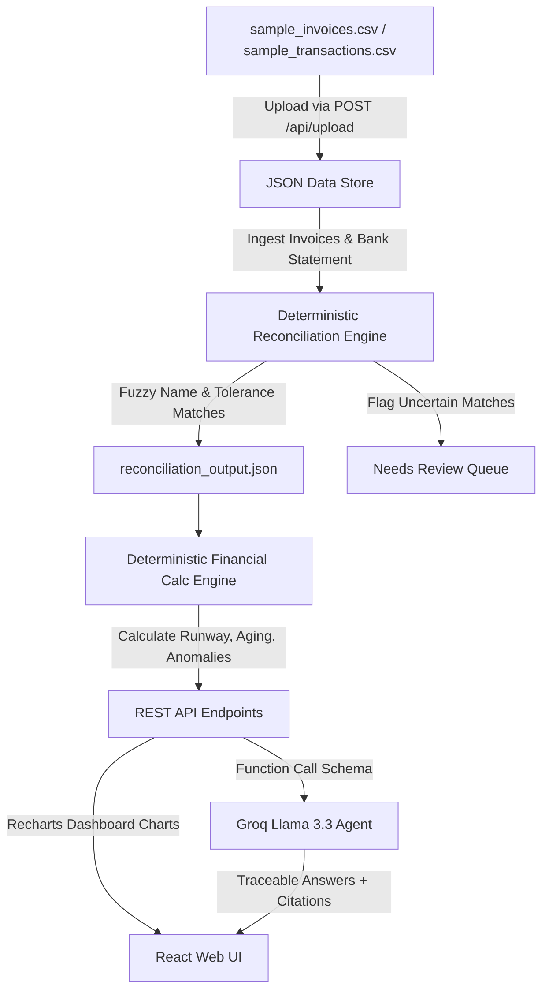

# FinancePilot AI — Reconciliation-First Financial Copilot

FinancePilot AI is an advanced financial dashboard and AI copilot designed for freelancers and small agencies. It solves the issue of numerical hallucinations in generic AI models by pairing a **deterministic python calculations/matching engine** with a **tool-calling LLM agent (Llama 3.3)**. The AI never does math itself—it orchestrates verified backend functions and returns answers cited directly back to original invoice or transaction records.

---

## 🏗️ Architecture Overview



1. **Synthetic Data Store**: Standardized datasets containing invoices, bank ledger credits, and categorized expense debits.
2. **Reconciliation Engine**: Matches credits to invoices in a three-stage waterfall (Exact matching $\rightarrow$ Fuzzy name/date similarity $\rightarrow$ "Needs Review" queue for confirmation).
3. **Financial Calc Engine**: Uses Pandas/Python logic to compute True Cash Runway, accounts receivable aging buckets (0-30, 30-60, 60+ days overdue), debtor balances, and statistical category anomalies.
4. **Agent Layer**: Single tool-using LLM agent (Groq Llama 3.3) coordinating deterministic API tool triggers, cited with clickable invoice/transaction badges.

---

## 🌟 Core Features

* **Interactive Split-Pane Layout**: Docked left navigation and right AI Chat panels. Hover and drag their divider borders to adjust panel widths dynamically.
* **Page Reload Persistence**: Current tab and authentication state are synchronized with `localStorage` so pressing `F5` preserves your active workspace.
* **Real CSV Ingestion & Reconciliation**: Upload custom spreadsheets directly in the UI. The deduplication safeguard prevents double-counting, and the engine automatically re-reconciles ledgers.
* **Receivables Aging & Cash Runway**: Computes runway months against a 3-month rolling burn rate and aggregates outstanding debt per client.
* **Statistical Anomaly Cards**: Flags expenses with a Z-score $> 2$ (e.g. unscheduled license upgrades or server bills) to catch billing errors.
* **Accuracy Evaluation Suite**: Interactive benchmark dashboard that runs a 10-question evaluation set, validating LLM tool-trigger accuracy and preventing arithmetic hallucinations.

---

## 📁 Project Directory Structure

```text
finance-ai-copilot/
├── backend/
│   ├── data/                   # Database JSON store (invoices, transactions, profile)
│   ├── calc/                   # Deterministic arithmetic engines (runway, aging, anomalies)
│   ├── reconciliation/         # Matcher logic & manual action overrides
│   ├── agent/                  # Groq client orchestrator & tool definitions
│   └── main.py                 # FastAPI application routes
├── frontend/
│   ├── src/
│   │   ├── components/         # Dashboard, Reconciliation, ChatPanel, LoginPage
│   │   ├── App.jsx             # Main app frame & resizable divider hooks
│   │   ├── api.js              # Fetch requests to FastAPI backend
│   │   └── main.jsx            # Entry point
│   ├── tailwind.config.js      # Calm CFO design token system
│   └── package.json            # Node.js configurations
├── sample_invoices.csv         # 200-row template invoice dataset
├── sample_transactions.csv     # 230-row template bank statement ledger
├── requirements.txt            # Python environment dependencies
└── README.md                   # Project documentation
```

---

## 🛠️ Step-by-Step Installation & Setup

### 1. Prerequisites
Ensure you have the following installed locally:
* **Python** (version 3.10 or higher)
* **Node.js** (version 20 or higher) & **npm**

### 2. Backend Setup
1. Open a terminal in the project root:
   ```bash
   # Create a virtual environment
   python -m venv .venv
   
   # Activate virtual environment (Windows Powershell)
   .venv\Scripts\Activate.ps1
   
   # Install dependencies
   pip install -r requirements.txt
   ```
2. Create a `.env` file in the root directory and add your Groq API Key:
   ```env
   GROQ_API_KEY=gsk_your_actual_key_here
   ```
3. Start the FastAPI development server:
   ```bash
   python -m uvicorn backend.main:app --reload --port 8000
   ```
   * *Swagger UI documentation is available at:* `http://127.0.0.1:8000/docs`

### 3. Frontend Setup
1. Open a separate terminal inside the `frontend` folder:
   ```bash
   cd frontend
   
   # Install Node packages
   npm install
   
   # Start Vite dev server
   npm run dev
   ```
2. Open your browser and navigate to **`http://localhost:5173`**.

---

## 🧪 Testing with Real CSV Data

1. Log into the dashboard (Credentials: `alex@mercer.studio`, password: `password`).
2. Go to the **Data Upload** tab.
3. Click the red **Reset Database** button in the header. Confirm to clear any initial seed data.
4. Click **Sample Invoices** and **Sample Transactions** in the header to download the 200+ row templates.
5. Drag and drop the downloaded CSV files into the upload box.
6. Verify that:
   * Ingested records show `"Successfully parsed X new records"`.
   * The **Executive Dashboard** updates instantly with detailed charts.
   * The **Reconciliation** tab populates with matches and review flags.
   * Suggestion prompts in the **Chatbot** (e.g. *Runway, Anomalies*) trigger successfully and display clickable source citations.
